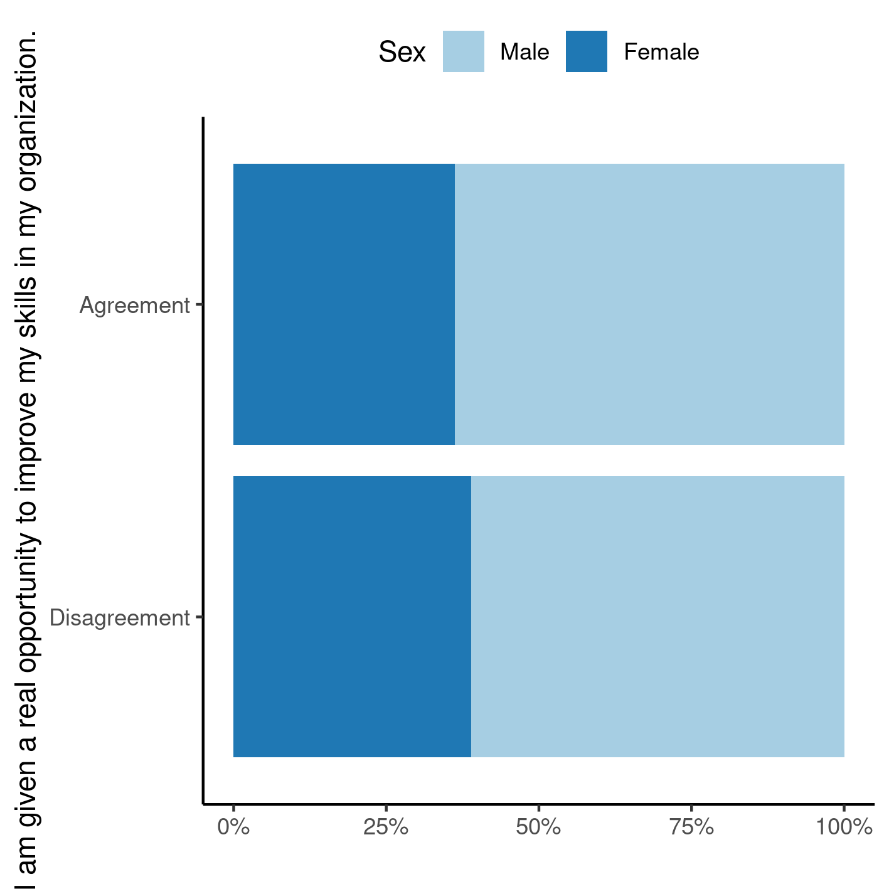

```{r setup, include=FALSE}
knitr::opts_chunk$set(echo = FALSE)
knitr::opts_knit$set(root.dir = normalizePath(".."))
options(scipen = 999)
library(pander)
library(knitr)
panderOptions('table.style', 'rmarkdown')
panderOptions('table.split.table', 160)
```

---

\newpage

**[title]**

**Document version**

```{r history}
Version <- c("01")
Changes <- c("Initial version")
history <- cbind(Version, Changes)
colnames(history) <- c("Version", "Alterations")
# pander(history, split.cells = 70)
kable(history)
```

---

# Abbreviations

# Context

## Objectives

## Data reception and cleaning

# Methods

```{r results, include=FALSE}
source("scripts/results.R", encoding = 'UTF-8')
```

## Variables

### Primary and secondary outcomes

### Covariates

## Statistical analyses

This analysis was performed using statistical software `R` version `r getRversion()`.

# Results

## Study population and follow up

```{r tab_desc}
tab_desc %>%
  as_kable(
    caption = "**Table 1** caption"
  )
```

```{r fig1, fig.cap="**Figure 1** caption"}
# 
# knitr::include_graphics("../figures/outcome.png", error = FALSE)
```

## Inferential analysis

```{r tab_inf}
tab_inf %>%
  as_kable(
    caption = "**Table 2** caption"
  )
```

# Observations and Limitations

# Conclusions

# References

- **SAP-yyyy-NNN-XX-v01** -- Analytical Plan for [title]

# Appendix

## Exploratory data analysis

```{r A1, fig.cap="**Figure A1** Distribution of age in the study population."}
# 
# knitr::include_graphics("../figures/distr_age.png", error = FALSE)
```

## Availability

Both this document and the corresponding analytical plan (**SAP-yyyy-NNN-XX-v01**) can be downloaded in the following address:

<!-- This document can be downloaded in the following address: -->

<https://philsf-biostat.github.io/SAR-yyyy-NNN-XX/>

<!-- The client has requested that this analysis be kept confidential. -->
<!-- Both this document and the corresponding analytical plan (**SAP-yyyy-NNN-XX-v01**) are therefore not published online and only the title and year of the analysis will be included in the consultant's Portfolio. -->
<!-- The portfolio is available at: -->

<!-- <https://philsf-biostat.github.io/> -->

## Analytical dataset

Due to confidentiality the data-set used in this analysis cannot be shared online in the public version of this report.

```{r data}
# print analytical of analytical_mockup whether it is the private or public version of the SAR

# analytical %>%
#   pander(caption = "**Table A1** Analytical dataset")
analytical_mockup %>%
  pander(caption = "**Table A1** Analytical dataset structure")
```
