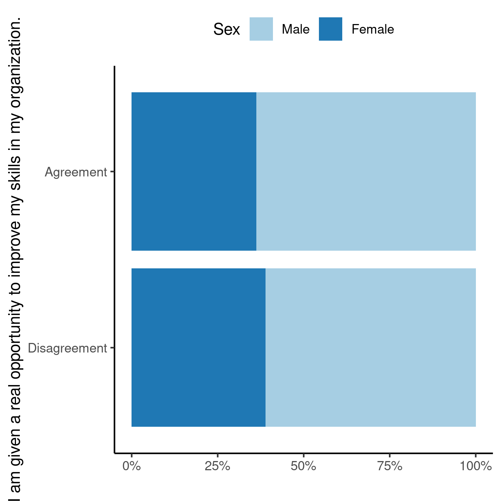

---

\newpage

**Association between leadership commitment and professional development at NASA (2020): unweighted sex-adjusted stratified analysis**

**Document version**

|Version |Alterations     |
|:-------|:---------------|
|01      |Initial version |

---

# Abbreviations

# Context

## Objectives

## Data reception and cleaning

# Methods

## Variables

### Primary and secondary outcomes

### Covariates

## Statistical analyses

This analysis was performed using statistical software `R` version 4.1.2.

# Results

## Study population and follow up

The raw database contained 10588 surveys, of which 1183 incomplete cases were removed.
Of the complete cases 1920 participants did not agree nor disagree with at least one of the survey questions.
These did not meet the inclusion criteria and were also removed from the analysis.
After the inclusion and exclusion criteria were applied the final number of surveys in the analysis is 7485.
Table 1 shows the characteristics of the surveys included in the final analysis.

Table: **Table 1** Characteristics of the study population.

|                                **Characteristic**                                 | **N = 7,485** |
|:---------------------------------------------------------------------------------:|:-------------:|
|                                  __Sex, n (%)__                                   |               |
|                                       Male                                        |  4,764 (64%)  |
|                                      Female                                       |  2,721 (36%)  |
| __I am given a real opportunity to improve my skills in my organization., n (%)__ |               |
|                                 Strongly disagree                                 |   73 (1.0%)   |
|                                     Disagree                                      |  166 (2.2%)   |
|                                       Agree                                       |  2,948 (39%)  |
|                                  Strongly Agree                                   |  4,298 (57%)  |
|       __Supervisors in my work unit support employee development., n (%)__        |               |
|                                 Strongly disagree                                 |   67 (0.9%)   |
|                                     Disagree                                      |   81 (1.1%)   |
|                                       Agree                                       |  1,986 (27%)  |
|                                  Strongly Agree                                   |  5,351 (71%)  |

One third of the employees at NASA are women
(36.4%, Table 1).
Both survey questions
addressed in this study showed most NASA employees demonstrated high levels of satisfaction when the survey was conducted.
The proportion of employees that agree or strongly agree with the satisfaction question
(q1 -- I am given a real opportunity to improve my skills in my organization)
was 96.8%.
The proportion of employees that agree or strongly agree with leadership commitment
(q21 -- Supervisors in my work unit support employee development)
was 98.0%.
Figure 1 shows how both sexes answered these questions.

**Figure 1** Dichotomized survey responses, by sex.

Men and women tended to answer the satisfaction question at the same rates in 2020.
Of the 7246 NASA employees that are in agreement with the satisfaction question,
36.3% were women,
and of the 239 employees that are in disagreement,
women were 38.9% (Figure 1).

## Association between leadership commitment and professional development

A binary categorization was performed between the two survey responses, where "Agreement" aggregates all answers "Agree" and "Strongly agree".
In order to compare how the responses to the leadership commitment and
<!-- telework satisfaction -->
employee development
relate to each other, a cross-tabulation of the dichotomized answers from each study participant is shown in Table 2.
This cross tabulation shows that the largest proportion of survey respondents are in agreement, simultaneously, to both questions.

The overall (unadjusted) effect of the association was significant (OR: 183.33, 95% CI: [121.86, 282.44], p<0.001).
This means that when survey respondents perceive leadership commitment, they are 183 times as likely to report
<!-- telework satisfaction -->
employee development
as participants that do not perceive such commitment from leadership.
Alternatively this translates to a 182-fold increase in the group of interest when compared to the reference group.

In order to control for a possible confounder between the association and the sex of the study participant, the analysis was stratified by sex.
The Mantel-Haenszel adjustment for the OR was similar to the overall unadjusted effect estimate
(adjusted OR: 180.62, 95% CI: [118.65, 274.96], p<0.001).
For comparison, the relative difference between the overall effect of association and the adjusted effect is on the order of
1.5%,
so we may rule out confounding between sex the association in this study.
If there was no interaction between sex and the association between leadership commitment and satisfaction it would be sufficient to report the unadjusted OR.

Table: **Table 2** Cross tabulation of dichotomized responses, overall and by sex of survey respondents.

|**Group** |**Characteristic**                                               | Disagreement | Agreement | **Total** |
|:---------|:----------------------------------------------------------------|:------------:|:---------:|:---------:|
|Overall   |__Supervisors in my work unit support employee development., n__ |              |           |           |
|          |Disagreement                                                     |     113      |    35     |    148    |
|          |Agreement                                                        |     126      |   7,211   |   7,337   |
|          |__Total, n__                                                     |     239      |   7,246   |   7,485   |
|Males     |__Supervisors in my work unit support employee development., n__ |              |           |           |
|          |Disagreement                                                     |      69      |    15     |    84     |
|          |Agreement                                                        |      77      |   4,603   |   4,680   |
|          |__Total, n__                                                     |     146      |   4,618   |   4,764   |
|Females   |__Supervisors in my work unit support employee development., n__ |              |           |           |
|          |Disagreement                                                     |      44      |    20     |    64     |
|          |Agreement                                                        |      49      |   2,608   |   2,657   |
|          |__Total, n__                                                     |      93      |   2,628   |   2,721   |

In order to assess whether or not there is an interaction between sex and the association under study we can compare the difference between the effects observed in each sex strata.
The effect sizes for men
(OR: 270.42, 95% CI: [151.84, 505.11], p<0.001)
were different to the effect of women
(OR: 115.35, 95% CI: [64.12, 215.70], p<0.001).
For comparison, the relative difference between the effect of association on males and females is on the order of
134.4%,
so we cannot rule out interaction between sex and the association in this study.
It is recommended to report stratum-specific effects of association in this context.

In summary, there is evidence of interaction with sex.
This means that, when they perceive high levels of leadership commitment, both men and women appear to show different levels of
telework satisfaction
<!-- employee development -->
when compared to the reference group.
In this context it is recommended to report the estimates of effect for both sexes as the result of the analysis.
This recommendation also accounts for confounding by sex.

Odds ratios + chi-square:

- Overall: OR: 183.33, 95% CI: [121.86, 282.44], p<0.001
- Adjusted CMH: OR: 180.62, 95% CI: [118.65, 274.96], p<0.001
- Men: OR: 270.42, 95% CI: [151.84, 505.11], p<0.001
- Women: OR: 115.35, 95% CI: [64.12, 215.70], p<0.001

# Observations and Limitations

<!-- **Small number of controls** -->

<!-- The number of employees that disagree with the satisfaction question -->
<!-- (q1 -- I am given a real opportunity to improve my skills in my organization) -->
<!-- is very small compared with the group that agrees with it. -->
<!-- This analysis may be critiqued for lack -->

# Conclusions

One third of NASA employees in this study are women.
Both men and women tended to derive satisfaction at the workplace in similar rates in 2020.

# References

- **SAP-2022-011-GJ-v01** -- Analytical Plan for Association between leadership commitment and professional development at NASA (2020): unweighted sex-adjusted stratified analysis

# Appendix

## Exploratory data analysis

**Figure A1** Raw survey responses, by sex.

## Availability

Both this document and the corresponding analytical plan (**SAP-2022-011-GJ-v01**) can be downloaded in the following address:

<!-- This document can be downloaded in the following address: -->

<https://philsf-biostat.github.io/SAR-2022-011-GJ/>

<!-- The client has requested that this analysis be kept confidential. -->
<!-- Both this document and the corresponding analytical plan (**SAP-2022-011-GJ-v01**) are therefore not published online and only the title and year of the analysis will be included in the consultant's Portfolio. -->
<!-- The portfolio is available at: -->

<!-- <https://philsf-biostat.github.io/> -->

## Analytical dataset

Due to confidentiality the data-set used in this analysis cannot be shared online in the public version of this report.

| id  | dsex | dv | iv | dv2 | iv2 |
|:---:|:----:|:--:|:--:|:---:|:---:|
|  1  |      |    |    |     |     |
|  2  |      |    |    |     |     |
|  3  |      |    |    |     |     |
| ... |      |    |    |     |     |
|  N  |      |    |    |     |     |

Table: **Table A1** Analytical dataset structure
